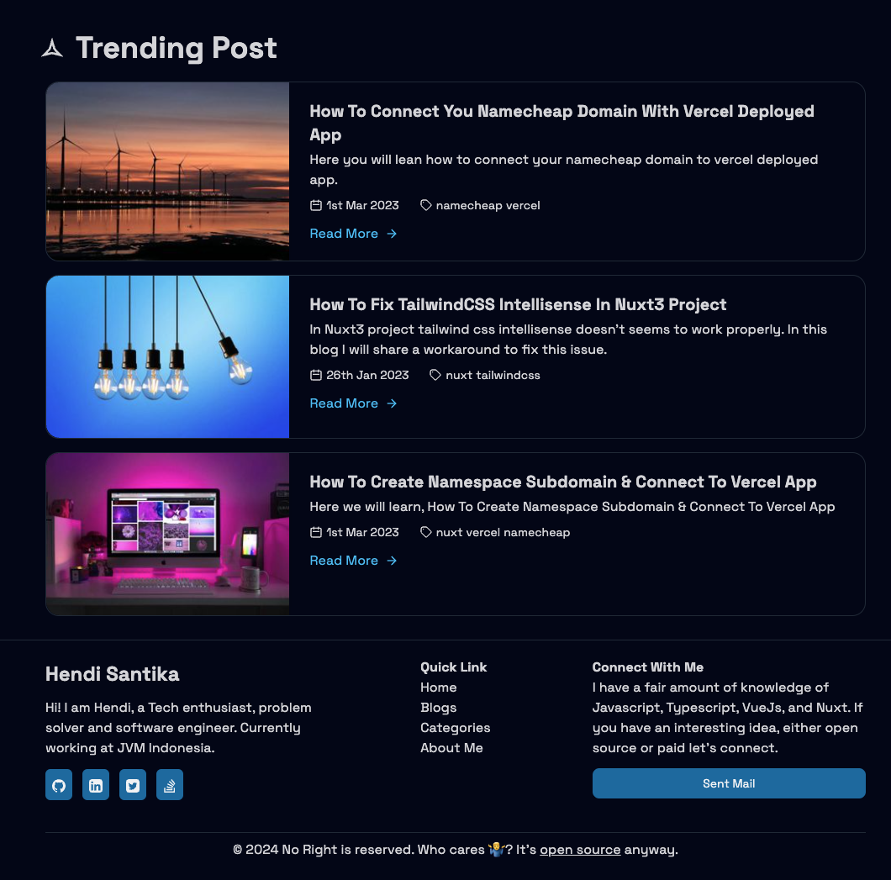
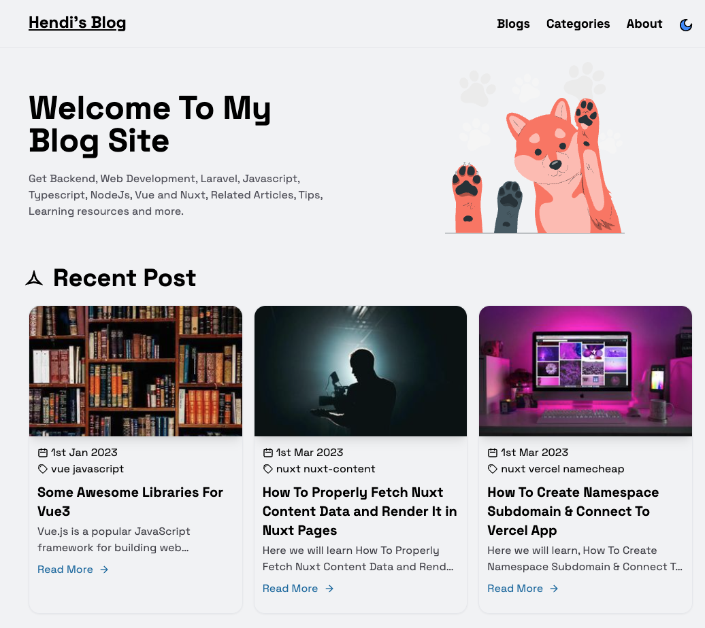

<p align="center">
  <a href="https://blog.hendisantika.my.id" target="_blank">
    
  </a>
</p>

<h1 align="center">Nuxt Blog A Personal Blog Site</h1>

### Built with

<p align="center">
    
</p>

Nuxt Blog built
with [Nuxt3](https://nuxt.com), [Nuxt-Content2](https://content.nuxtjs.org/blog/announcing-v2/), [Vue3](https://vuejs.org) & [TailwindCss](https://tailwindcss.com/)

## Features

- Write blog with markdown file
- Auto generate category from blog post
- Blog list page with search and pagination
- About me page for user info
- Auto generate table of content for blog post
- Auto generate Sitemap
- Url preview with Nuxt ogImage
- Dark and light mode
- Server Side Rendered(SSR) with Nuxt3

## Preview

<p align="center">
  <a href="https://blog.hendisantika.my.id" target="_blank">
    
    
    
    
    
    
    
    
    <br>
    Live Demo
  </a>
</p>

## Demo

https://blog.hendisantika.my.id

> Hosted on [Vercel](https://vercel.com/): `npm run build`

## Build Setup

**Requires Node.js 16+**

```bash
# install dependencies
yarn install

# serve in dev mode, with hot reload at localhost:5173
yarn run dev

# build for production
yarn run build

# serve in production mode
yarn run  preview

```
